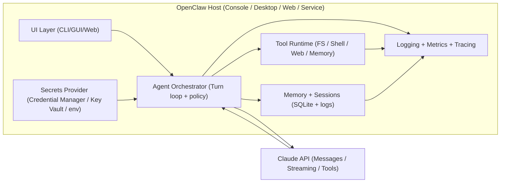

# Deep Research Report on Building OpenClaw on Windows with C#/.NET and the Claude API

## Scope, knowns, unknowns, and deliverables

This report analyzes a typical OpenClaw plan and, where applicable, explicitly calls out concrete gaps and risks found in the provided OpenClaw-style blueprint (a .NET console agent architecture with tools, memory, sessions, and security hardening). fileciteturn1file1

### What is known

You are building OpenClaw on Windows in C#/.NET, and you want direct Claude API integration (HTTPS / REST), with **no messenger platforms** in the loop. citeturn17search4

Your current plan direction (as reflected in the blueprint) implicitly targets a local, Windows-first agentic application with:
- a console UX (Spectre.Console), streaming output, and a tool-using agent loop,
- support for Claude tool-use and manual tool execution control,
- persistent local sessions and local hybrid memory (SQLite + embeddings), and
- Windows-side security hardening for tool execution and secret storage. fileciteturn1file1turn1file3turn1file13turn1file9

### What is explicitly unspecified (and why it matters)

**Windows version** is unspecified. This matters for packaging choices (e.g., MSIX prerequisites) and enterprise deployment constraints (Windows 10 vs 11 vs Server). MSIX packaging support depends on Windows 10 version 1607+ (and later), and your minimum supported Windows version should be explicit. citeturn5search4

**.NET version** is unspecified. This matters for:
- support lifecycle (LTS vs STS),
- availability/quality of new networking and resilience libraries,
- publishing modes (single-file, trimming behavior), and
- compatibility with the Claude SDK and “modern extensions” packages. citeturn1view5turn5search0turn4search2

**OpenClaw architecture** is unspecified (console app vs web API vs desktop app vs background service). That choice drives:
- where secrets live,
- whether Claude calls are client-side or server-side,
- how to stream responses (terminal vs web sockets/SignalR),
- deployment (installer vs container vs service),
- and your threat model (single-user CLI vs multi-tenant server). fileciteturn1file1turn1file3

**Claude API details** are unspecified in your prompt, so this report prioritizes official Anthropic documentation for endpoints, headers, tool-use rules, streaming, rate limits, token counting, SDK availability, and privacy controls. citeturn17search4turn9search1turn3search6turn2search1turn11search4turn9search28turn3search21

### Deliverables produced in this report

This report explicitly provides:

1) A comprehensive list of required components/dependencies for OpenClaw on Windows + C#/.NET + Claude API integration. citeturn13view0turn4search0turn5search3turn7search2  
2) Detailed Claude API integration guidance for .NET (auth, request/response, streaming, rate limits, retries/backoff, code patterns). citeturn17search4turn3search6turn9search25turn3search1turn4search2turn15search0turn13view1  
3) Security and secrets management guidance for Windows + CI/CD (DPAPI, Credential Manager, user secrets, Key Vault, GitHub Secrets). citeturn6search10turn6search2turn6search0turn6search5turn9search28turn3search21  
4) Build/test/CI/CD and packaging recommendations (structure, testing approach, pipeline patterns, Windows packaging, code signing). citeturn7search0turn7search5turn5search0turn5search4turn5search2turn7search2  
5) Runtime and ops/runbook considerations (logging, observability, error handling, scaling, throttling, caching, cost control). citeturn3search0turn3search1turn2search3turn9search1turn16search3turn16search9  
6) Legal/compliance/data privacy considerations (API retention/training, ZDR, deletion limitations, data residency controls). citeturn3search21turn9search28turn17search1turn17search0turn17search19  
7) A testing/validation checklist (unit → integration → E2E → perf/load → security). citeturn3search6turn4search0turn9search1turn15search0turn16search3  
8) A prioritized gap list (with severity, why it matters, remediation). fileciteturn1file1turn1file9turn1file3  
9) A step-by-step implementation checklist and rough timeline for 1–3 developers. citeturn1view5turn7search0turn5search0turn13view1  
10) A comparison table of approach options and trade-offs (SDK vs raw HTTP, app types, hosting, .NET versions). citeturn11search4turn4search0turn4search35turn1view5turn5search4turn17search0  

## Platform and architecture decisions that must be nailed down early

### Windows and .NET version choices

If you’re starting this project now (February 2026), the biggest versioning landmine is choosing a .NET runtime that will stay supported through your expected maintenance horizon.

Microsoft’s .NET support policy (updated January 13, 2026) shows:
- **.NET 10** is LTS and supported until **November 14, 2028**,
- **.NET 8** is LTS but ends support **November 10, 2026**,
- **.NET 9** is STS and ends support **November 10, 2026**. citeturn1view5turn1view6

**Recommendation (forward-looking, no fluff):**
- Use **.NET 10 (LTS)** for a new OpenClaw build unless you have a hard constraint. It buys you time and reduces forced-upgrade pressure within the next ~9 months. citeturn1view5turn1view6  
- Use **.NET 8 (LTS)** only if you’re aligning with an existing internal stack *and* you already have a planned upgrade motion before November 2026. citeturn1view5turn1view6  

Windows version remains unspecified, so your packaging and service hosting approach should be chosen with explicit minimums:
- If you plan MSIX distribution, ensure your minimum target meets the MSIX tooling constraints (Windows 10 version 1607+). citeturn5search4  
- If you plan Windows Service hosting, worker/service templates and hosting infrastructure support are stable across modern Windows versions, but you still need to decide whether you’re targeting consumer endpoints (Windows 10/11) or server endpoints (Windows Server SKUs) for ops hardening and deployment workflows. citeturn4search35turn4search7turn16search7  

### Choose the application form factor based on your threat model

Your blueprint clearly leans toward a **console-based, single-user agent** (Spectre.Console, local memory DB, local sessions). fileciteturn1file1turn1file3 That’s a solid first ship for velocity; it also keeps secrets on the developer machine and avoids multi-tenant server risks.

But you should explicitly decide which of these OpenClaw incarnations you’re building:

- **Console app (single-user)**: simplest iteration loop, easiest streaming UX, lowest infra overhead, but secrets live on endpoints and local tool execution is high-risk if misconfigured. fileciteturn1file1turn1file9  
- **Desktop app (WinForms/WPF/WinUI)**: better UX, easier distribution to non-technical users, but you must treat it like an endpoint product (code signing, auto-update, stronger sandboxing) and likely need MSIX or MSI installers. citeturn5search4turn5search1turn5search2  
- **Web API (server-side)**: centralizes secrets and tool execution, scales best for teams, but becomes a real security product (authn/z, multi-tenant isolation, request limits, audit trails). citeturn4search0turn4search2turn16search3  
- **Background service (Windows Service)**: best for scheduled/daemon workloads (batch processing, watchers), but requires service lifecycle ops, Event Log integration, and installer/service management. citeturn4search35turn4search3turn16search7  

Your plan can remain modular and support multiple shells by keeping:
- agent loop + model client + tool registry + memory/session as reusable libraries, and
- separate “hosts” (ConsoleHost, WebHost, ServiceHost) as thin composition roots. fileciteturn1file4turn1file3  

### Architecture diagram to align the team

Below is a reusable architecture diagram you can paste into Mermaid (for example, in a README) to keep scope tight. It shows the minimal “direct Claude API” approach with no messenger platforms.



This matches the blueprint’s separation-of-concerns shape (core/AI/tools/memory/skills/console host) but makes the “policy boundary” explicit: **the orchestrator must enforce security and approval gates**, not the model. fileciteturn1file4turn1file9turn1file11

## Required components and dependencies for OpenClaw on Windows

This section consolidates what you’ll need for a robust Windows + .NET build, and highlights where your plan is strong vs where it’s incomplete.

### Core runtime, build, and project dependency foundations

At minimum:
- **.NET SDK** installed on dev machines and CI runners. For reproducibility, pin with `global.json`. (The report recommends .NET 10 LTS unless constrained.) citeturn1view5turn7search4turn7search0  
- **dotnet CLI / MSBuild** as the build engine (standard). citeturn5search9turn7search0  
- **Central Package Management** via `Directory.Packages.props` to prevent version drift across multi-project solutions. This is already present in your blueprint and is the right move. citeturn7search2turn7search14turn1file3  

Your blueprint’s multi-project split (Core / AI / Tools / Memory / Skills / Console + tests) is structurally sound for scaling and for adding additional host types later. fileciteturn1file3turn1file4

### Claude API client dependency options

You have three practical integration approaches, and you should choose one intentionally (not accidentally).

**Option A: Official Anthropic C# SDK (`Anthropic` NuGet)**  
Anthropic’s docs confirm there is an official C# SDK, currently in beta, available as the `Anthropic` package (v10+). It supports streaming semantics and includes `IChatClient` integration with `Microsoft.Extensions.AI.Abstractions`. citeturn13view0turn13view1turn11search4turn11search0  
This is the long-term “safe bet” because it’s official, but the beta warning means you should expect breaking changes and treat it as a moving dependency. citeturn13view1turn13view0  

**Option B: Community SDK (`Anthropic.SDK` NuGet by tghamm)**  
Your blueprint recommends this as “more mature,” with convenience helpers for `IChatClient`, `UseFunctionInvocation()`, and other utilities. It is explicitly **unofficial** and not affiliated with Anthropic. citeturn10view0turn11search6  
This option can be great for fast prototyping because it includes patterns you’d otherwise implement yourself (especially around tool invocation abstractions). But it’s a supply-chain and longevity risk compared with an official SDK. citeturn11search6turn13view0  

**Option C: Raw HTTP integration (no SDK dependency)**  
This provides maximum control and minimum vendor coupling. It also forces you to implement fixes for:
- correct header management (`x-api-key`, `anthropic-version`, and beta headers),
- robust SSE streaming handling,
- retries/backoff/rate limiting,
- strict tool-use formatting rules,
- and request-id logging. citeturn17search4turn9search25turn14search1turn3search6turn15search0turn3search0  

Your plan already includes `System.Net.ServerSentEvents` as an SSE parser option (good call). fileciteturn1file1 and this package exists as a .NET library that provides `SseParser` for parsing SSE streams. citeturn12search0  

### Additional key dependencies commonly required

Below is a practical dependency checklist (not tied to any one architecture), with citations to authoritative docs where possible:

- **HTTP client lifecycle and resilience**: use `IHttpClientFactory` (or an equivalent long-lived handler strategy) to avoid common socket/DNS issues, then add resilience with `Microsoft.Extensions.Http.Resilience` (preferred modern approach) to implement retries/timeouts/circuit breakers/rate limiting. citeturn4search0turn4search8turn4search2turn4search10turn4search14  
- **Windows Service hosting** (if you choose service form factor): `Microsoft.Extensions.Hosting.WindowsServices` and `.UseWindowsService()`. citeturn4search7turn4search3turn4search35  
- **Publishing and packaging**:
  - `dotnet publish`, self-contained deployments, and single-file publishing. citeturn5search3turn5search0turn5search9  
  - For desktop packaging: MSIX packaging projects and prerequisites. citeturn5search4turn5search1  
  - For service installers: WiX-based Windows Service installer guidance exists in Microsoft docs. citeturn5search19  
  - For code signing (strongly recommended for distributed binaries): SignTool documentation. citeturn5search5turn5search2  
- **Secrets management**:
  - Development: .NET user secrets are intended for dev-time secret storage (not production). citeturn6search2  
  - Windows local secret encryption: DPAPI is available for Windows-oriented encryption, and .NET has DPAPI access. citeturn6search10  
  - CI/CD: GitHub Actions secrets are encrypted and exposed only when referenced. citeturn6search5turn6search15  
  - Enterprise production: Azure Key Vault secrets best practices include least privilege and rotation guidance. citeturn6search0turn6search18turn6search7  
- **Observability**:
  - .NET logging via `ILogger` is a first-class structured logging mechanism. citeturn16search9turn16search23  
  - OpenTelemetry-based observability in .NET is explicitly supported via platform APIs + OTel exporters/instrumentation. citeturn16search3turn16search18  

## Claude API integration in C#/.NET

This is the core of OpenClaw. The “agent loop” and the “security policy boundary” live or die on how you implement Claude API calling, tool use, and streaming.

### Authentication, headers, and versioning

If you implement raw HTTP, the Claude API requires that you include:
- `x-api-key` for auth,
- `anthropic-version` for API versioning,
- and `content-type: application/json` for JSON bodies. citeturn9search25turn17search4turn13view0

Anthropic’s versioning documentation explicitly requires the `anthropic-version` header on API requests (SDKs handle it automatically). citeturn9search25

If you use beta features (compaction, code execution tool, Files API, web fetch, long context headers, etc.), you opt-in via the `anthropic-beta` header. citeturn14search1turn14search13turn14search29turn14search25turn9search11

### The Messages API and streaming

OpenClaw’s interactive UX basically requires streaming. Claude streaming is documented as Server-Sent Events (SSE), and the streaming docs describe event streams with ping events and error events (including `overloaded_error`, which corresponds to HTTP 529 in a non-streaming context). citeturn3search6

If you use the official C# SDK, streaming is exposed as an `IAsyncEnumerable` over streaming “chunks.” The official SDK docs show `CreateStreaming(...)` and explicitly state that streaming methods return `IAsyncEnumerable`. citeturn13view1turn13view0

### Tool use protocol and formatting rules

If OpenClaw is tool-using (files, shell, web fetch, memory read/write), your implementation must follow Claude’s tool use constraints precisely, because the API will reject malformed tool/result sequences.

The tool use implementation guide explicitly states:
- tool result blocks must immediately follow tool use blocks with no intervening messages,
- and within the user message containing tool results, `tool_result` blocks must come first (text afterward). citeturn15search0

Your blueprint correctly calls out these rules and is directionally aligned with the official docs, but the enforcement must be done in the orchestrator (not “by convention”). fileciteturn1file1turn1file11

### Rate limits, retries, backoff, and request correlation

Anthropic’s rate limits are explicitly measured (RPM, ITPM, OTPM), and exceeding them returns 429 with a `retry-after` header. citeturn3search1turn2search1turn2search5

For reliability and supportability, you should also log the `request-id` response header on every Claude response; Anthropic’s errors documentation calls out that every API response includes a unique request-id and that it’s needed for support escalation. citeturn3search0turn3search4

### Token counting and cost control hooks

Anthropic provides a token counting endpoint: `POST /v1/messages/count_tokens`. It counts tokens for a message *without creating it*, and its guidance emphasizes it should be considered an estimate (actual input tokens may differ slightly). citeturn9search1turn9search2

The API overview also lists token counting and the Models API (`GET /v1/models`) which you can use to discover available models at runtime. citeturn9search8turn17search2

### Code patterns (concise, illustrative)

#### Official Anthropic C# SDK (recommended baseline for long-term stability)

The official SDK is `Anthropic` (v10+), officially documented as the C# SDK, but explicitly labeled beta. citeturn13view0turn13view1turn11search0

```csharp
using Anthropic;
using Anthropic.Models.Messages;

// Uses ANTHROPIC_API_KEY and ANTHROPIC_BASE_URL if set.
var client = new AnthropicClient();

var parameters = new MessageCreateParams
{
    Model = "claude-opus-4-6",
    MaxTokens = 1024,
    Messages =
    [
        new() { Role = Role.User, Content = "Hello, Claude" }
    ],
};

var message = await client.Messages.Create(parameters);
Console.WriteLine(message);
```

This structure is directly aligned with the official C# SDK documentation. citeturn13view0turn13view1

Streaming:

```csharp
await foreach (var chunk in client.Messages.CreateStreaming(parameters))
{
    Console.WriteLine(chunk);
}
```

The SDK explicitly documents that streaming methods return `IAsyncEnumerable`, and shows `CreateStreaming`. citeturn13view1

#### Raw HTTP with `IHttpClientFactory` and resilience pipelines (if you need maximum control)

Use `IHttpClientFactory` to manage sockets/handlers and integrate logging/configuration cleanly. citeturn4search0turn4search8  
Add resilience with `Microsoft.Extensions.Http.Resilience` (retry/timeout/circuit breaker/rate limit). citeturn4search2turn4search10turn4search14

Pseudocode sketch:

```csharp
// Registration
services.AddHttpClient("Claude", http =>
{
    http.BaseAddress = new Uri("https://api.anthropic.com");
    http.DefaultRequestHeaders.Add("anthropic-version", "2023-06-01");
    // x-api-key should NOT be hard-coded—inject from secrets provider per request.
})
.AddStandardResilienceHandler(); // configure retry/timeout/rate limiting with options
```

The HttpClientFactory pattern and the resilience library are documented by Microsoft. citeturn4search0turn4search2

Then per request:

```csharp
var req = new HttpRequestMessage(HttpMethod.Post, "/v1/messages");
req.Headers.Add("x-api-key", apiKey); // from secrets provider
req.Content = JsonContent.Create(new {
    model = modelId,
    max_tokens = 1024,
    messages = new[] { new { role = "user", content = "Hello" } }
});
```

Raw HTTP requires correct header management as described in Claude API docs (including `anthropic-version`). citeturn9search25turn17search4

#### Streaming SSE parsing helper (raw HTTP)

Claude streaming uses SSE. citeturn3search6  
For parsing SSE in .NET, `System.Net.ServerSentEvents` provides `SseParser`. citeturn12search0  
This is a reasonable low-level implementation primitive if you decide not to rely on an SDK stream wrapper.

## Security, secrets, privacy, and compliance

OpenClaw is inherently a high-risk application if it can execute tools (shell, file writes, web fetch). Your plan correctly treats tool-execution security as “non-negotiable” and proposes layered controls (credential storage, job objects, allowlists, path validation, human approvals). fileciteturn1file9turn1file11  
This section hardens those ideas with official guidance and adds missing compliance/privacy edges.

### Secrets management on Windows and in CI/CD

**Development-only**: .NET user secrets are designed for development-time secret storage and should not be used as a production secret store. citeturn6search2

**Windows-local**:
- DPAPI is Windows-specific encryption exposed via .NET, and it’s suitable for encrypting secrets bound to a user or machine context. citeturn6search10  
- Your blueprint proposes Windows Credential Manager usage. Treat this as reasonable for a developer CLI or desktop app, but recognize its limitations for services and roaming profiles. (This limitation is a risk to document, not a reason to avoid it.) fileciteturn1file9  

**CI/CD**:
- GitHub Actions secrets are encrypted and only readable when explicitly referenced in a workflow. Use environment-level secrets with required reviewers for deployment gates when needed. citeturn6search5turn6search33  

**Production**:
- Azure Key Vault best practices emphasize rotation, least privilege access, and automation patterns. citeturn6search0turn6search7turn6search18  

### Data retention, deletion, and Zero Data Retention

You must decide what privacy posture OpenClaw needs, because it directly impacts which Claude endpoints/features you can safely use.

Anthropic’s privacy center states that API data is not used for training unless you have an agreement stating otherwise, and that ad hoc deletion for paid API customers is not generally supported. This affects how you handle PII, and how you design “forget” features. citeturn3search21

Anthropic’s Zero Data Retention (ZDR) doc clarifies:
- `/v1/messages` and `/v1/messages/count_tokens` are listed as fully ZDR-eligible,
- but `/v1/messages/batches` is not ZDR-eligible and has a standard retention policy (documented as 29-day retention),
- and `/v1/files` is not ZDR-eligible and files are retained until explicitly deleted. citeturn9search28turn17search1turn14search29

This is a major architectural fork:
- if you need the strongest privacy posture, avoid non-ZDR endpoints (Batch API, Files API) unless you have a contractual arrangement and deletion/runbook procedures. citeturn17search1turn9search28  
- if you need cost-optimized async processing, Batch API is attractive but comes with explicit retention and operational deletion work. citeturn9search8turn17search1  

### Data residency controls

If data locality matters (regulated industries, internal compliance), Anthropic documents data residency controls:
- per-request control via `inference_geo` set to `"us"` or `"global"`,
- workspace-level controls in the console (`default_inference_geo`, `allowed_inference_geos`). citeturn17search0turn17search4turn17search27

If you ignore this until late, you risk rework (policy, routing, usage tracking, and compliance audits). You should treat it as an early design decision.

### Tool execution security

Your blueprint proposes strong baseline measures: allowlists/blocklists, path canonicalization, job object sandboxing, and human approval for risky actions. fileciteturn1file9turn1file11  
The technical risk to highlight is that these controls must be:
- enforced centrally,
- audited and testable,
- and resistant to prompt injection (model output is not a safe source of truth).

Also, Claude’s own tool-use docs warn about interaction patterns: “handling stop reasons” guidance includes explicit advice about tool results and how you message the model after tool use. Your orchestrator should follow the official stop-reason handling guidance to avoid teaching bad interaction patterns or causing tool loops to behave unpredictably. citeturn15search3turn15search0

## Build, test, CI/CD, packaging, and operations

### Build and project structure

Your plan’s solution split + central package management is good engineering hygiene for a project like OpenClaw. fileciteturn1file3turn1file5  
To strengthen it further, add:
- `global.json` to pin the .NET SDK version,
- locked package restore (`packages.lock.json`) in CI to prevent supply-chain surprises,
- and automated dependency update policies (Renovate/Dependabot) with merge gates.

Central Package Management is the supported Microsoft approach for consolidating package versions. citeturn7search2turn7search14

### Testing strategy and validation steps

A tool-using agent needs tests in layers:

**Unit tests (fast, deterministic)**
- Tool policy enforcement (allowlist, forbidden args patterns, path root enforcement). fileciteturn1file9  
- Prompt construction logic (system prompt builder) and “untrusted content” wrapping patterns. fileciteturn1file7turn1file9  
- Session serialization formats (JSONL append/restore) and migrations. fileciteturn1file13turn1file16  

**Integration tests (real serialization + real HTTP surface, fake Claude)**
- Use an in-memory test server (or a stub) to validate request headers (`anthropic-version`, `x-api-key` formatting), tool result ordering, and streaming SSE parsing. citeturn9search25turn15search0turn3search6turn12search0  
- Validate retry/backoff behavior against simulated 429 + `retry-after` behavior. citeturn3search1turn2search1  

**End-to-end tests (optional but powerful)**
- A controlled “demo workspace” with safe tools (read-only file tool + memory search only) to validate that the agent loop works against real Claude API conditions. citeturn3search6turn15search0  

**Performance/load tests**
- Measure throughput and stability under concurrent user sessions, especially if you adopt a web/server architecture.
- Validate token counting endpoint usage and that rate limits are respected under concurrency. citeturn9search1turn3search1turn2search1  

**Security tests**
- Prompt injection test corpus: verify the orchestrator does not bypass approvals.
- Path traversal tests.
- Command argument injection tests (quotes, special characters).
- Log redaction tests (no API keys, no secrets). fileciteturn1file9  

### CI/CD recommendations

**GitHub Actions** provides a standard “build and test .NET” path with actions/setup-dotnet. citeturn7search0turn7search4  
**Azure Pipelines** has standard tasks for dotnet build/test/publish and pipeline artifacts. citeturn7search5turn7search1  

Regardless of CI vendor, the pipeline should:
- restore/build/test on every PR,
- run basic static checks (format analyzers, warnings-as-errors),
- publish signed artifacts for releases,
- and store build outputs as versioned artifacts.

### Packaging and deployment options on Windows

Your packaging choice depends on your host type:

- **Console app**: publish self-contained single file for win-x64, optionally with trimming (careful with reflection-heavy libs). .NET single-file publishing is documented and suitable here. citeturn5search0turn5search3  
- **Desktop app**: MSIX packaging is a modern distribution format with tooling support, but requires Windows 10 version 1607+ minimum for the packaging project workflow. citeturn5search4turn5search1  
- **Windows Service**: if deploying to servers, consider service installers and/or scripted deployments; Microsoft provides guidance for Windows service installers via WiX templates. citeturn5search19turn4search35  

For any third-party distributed binaries, code signing is not optional if you want low friction and trust. Microsoft documents SignTool for signing and timestamping. citeturn5search5turn5search2  

### Operational runbook essentials

These are non-negotiable “runbook” items for OpenClaw:

- **Request tracing**: log Claude `request-id` for every API call (and correlate it with your own session/turn IDs). citeturn3search0turn3search4  
- **Rate-limit handling**: implement standardized handling for 429 with `retry-after` and expose backpressure to users instead of blindly retrying. citeturn3search1turn2search1  
- **Timeouts and retries**: use explicit timeouts and a clear retry policy for transient errors; Microsoft’s guidance supports resilience mechanisms for HTTP. citeturn4search2turn4search8  
- **Cost controls**: implement token counting for large prompts and instrument usage; token counting endpoint exists and is free to call (per docs), and batch processing trade-offs must be explicit. citeturn9search1turn9search2turn17search1turn9search8  
- **Privacy posture**: decide whether OpenClaw must be ZDR-only; if yes, do not use endpoints and features marked non-ZDR unless contractually covered. citeturn9search28turn17search1  
- **Observability**: use structured logging (`ILogger`) and, for richer insight, add OpenTelemetry traces/metrics for outbound HTTP and internal turn/tool events. citeturn16search9turn16search3turn16search18  

## Gap analysis, prioritized action items, and implementation checklists

This is where I stop being polite and start being useful: the plan is strong in “agent structure,” but typical plans for this kind of project still miss critical operational, privacy, and release engineering pieces. The table below blends (a) gaps seen in typical OpenClaw-style plans and (b) concrete gaps/risk areas relative to your blueprint’s current level of specificity. fileciteturn1file1turn1file9turn1file3

### Prioritized gap list

| Gap / missing piece | Severity | Why it matters | Remediation |
|---|---|---|---|
| Explicit Windows version support matrix (Win10/11/Server, x64/ARM64) | High | Packaging/installers and enterprise deployment rules differ; MSIX packaging toolchains have minimum Windows requirements. citeturn5search4 | Declare supported Windows SKUs + minimum version; decide win-x64 vs win-arm64; document packaging per SKU. |
| Explicit .NET target choice and support horizon | High | Picking .NET 8 now means an end-of-support cliff in Nov 2026; .NET 10 is LTS to 2028. citeturn1view5turn1view6 | Choose .NET 10 (preferred) or document why not; pin SDK via `global.json`. |
| Privacy posture not formalized (ZDR-only vs using Files/Batch) | Critical | ZDR eligibility differs by endpoint; Batch and Files are not ZDR-eligible and have retention implications. citeturn9search28turn17search1turn3search21 | Decide required posture; implement endpoint policy gates; document retention and deletion runbooks. |
| Data residency controls not planned (`inference_geo`, workspace policy) | High | Compliance often requires geographic routing; retrofitting it later is painful and risky. citeturn17search0turn17search4turn17search19 | Add config support and test routing; decide defaults; add operational verification. |
| Robust rate-limit governance (global throttling, `retry-after`, backpressure UX) | High | Claude rate limits are token-based; naive concurrency can cause storms and unpredictable user experience. citeturn3search1turn2search1turn2search5 | Implement request queue + per-model token budgeting + `retry-after` handling; add user-visible status and circuit breakers. |
| Strict tool-use formatting enforcement as code (not “by convention”) | Critical | Incorrect tool/result sequencing yields hard failures (400s) and tool loop instability. citeturn15search0 | Implement invariant checks in orchestrator; unit-test the tool result ordering and adjacency rules. |
| “Official vs community SDK” dependency strategy and migration path | Medium | Official C# SDK is beta; community SDK is unofficial. Without a policy, upgrades will break you at the worst time. citeturn13view0turn11search6turn13view1 | Choose a primary; wrap behind an internal interface; add contract tests against both if you want optionality. |
| Observability spec and correlation IDs (turn_id/session_id/request-id) | High | Without correlation, production debugging is slow and expensive; Anthropic support expects request-id. citeturn3search0turn16search3turn16search9 | Adopt structured logging schema; log request-id; add tracing spans around API calls and tool execution. |
| Release engineering: packaging, signing, update strategy | High | If OpenClaw is distributed beyond you, unsigned binaries and inconsistent installers will kill adoption. citeturn5search2turn5search4turn5search0 | Decide: single-file exe vs MSIX vs MSI; implement signing in CI; document upgrade/uninstall path. |
| Security testing is underspecified (prompt injection corpus, tool bypass tests) | High | The scariest failures here are not “bugs,” they’re policy bypasses and unsafe tool execution. fileciteturn1file9 | Define adversarial test suites; implement mandatory approval gates; audit logs; continuous security checks. |

### Implementation checklist (step-by-step)

This is an execution-oriented checklist you can run like a playbook. (You asked for no full implementation; this stays at “integration points and steps.”)

| Step | Output | Key integration points | Done criteria |
|---|---|---|---|
| Decide host type (console vs desktop vs web vs service) | Architecture decision record | Host composition root; streaming UX; secret location | Decision documented; threat model defined |
| Pick .NET LTS and pin SDK | `global.json`, `TargetFramework` | Solution-wide SDK pinning | CI and dev match; no “works on my machine” |
| Choose Claude integration mode | Internal `IClaudeClient` abstraction | Official `Anthropic` SDK vs community `Anthropic.SDK` vs raw HTTP | Minimal “hello message” + streaming works |
| Implement request pipeline | HttpClientFactory + resilience | `IHttpClientFactory`, `Microsoft.Extensions.Http.Resilience` | Retries/timeouts/rate limiting validated |
| Implement tool use loop (manual) | Orchestrator tool loop | Tool result formatting invariants; human approval gates | Tool use works; 400 errors eliminated |
| Implement token counting + context controls | Token counting calls + policy | `/v1/messages/count_tokens`, compaction strategy | Token budget tracked; overflow policy tested |
| Implement secrets provider | Secret storage & retrieval | Credential Manager / DPAPI, GitHub Secrets, Key Vault | No secrets in repo/logs; rotation workflow defined |
| Implement session persistence | JSONL sessions + migrations | SessionStore read/write; schema versioning | Sessions survive restart; backward compatibility |
| Implement logging and observability | Logs + traces + metrics | `ILogger`, OpenTelemetry instrumentation | request-id logged; per-turn correlation works |
| CI pipeline | Build/test/package artifacts | GitHub Actions or Azure Pipelines | Every PR validated; release artifacts produced |
| Packaging + signing | Installable/signed output | `dotnet publish`, MSIX/MSI decisions, SignTool | Users can run/verify signature; upgrade path defined |
| Operational runbook | On-call guide | Rate limit procedures; outage/retry behaviors | Documented remediation steps and dashboards |

This checklist is aligned with Microsoft build/deploy guidance (`dotnet publish`, single-file publish), resilience guidance, and GitHub Actions/Azure Pipelines standard practices. citeturn5search9turn5search0turn4search2turn7search0turn7search5turn5search2

### Timeline estimate for a 1–3 developer team

Assumptions: you’re building the console-first version (like the blueprint), with a manual tool loop, basic local memory, and a CI pipeline. Larger UI/platform ambitions expand time.

Gantt-style table (✓ = primary work weeks):

| Milestone | Week 1 | Week 2 | Week 3 | Week 4 | Week 5 | Week 6 |
|---|---:|---:|---:|---:|---:|---:|
| Architecture decisions + repo scaffolding | ✓ |  |  |  |  |  |
| Claude API integration + streaming | ✓ | ✓ |  |  |  |  |
| Tool system + approval gates + audit log |  | ✓ | ✓ |  |  |  |
| Sessions + token counting + context policy |  |  | ✓ | ✓ |  |  |
| Memory v1 (SQLite keyword search) |  |  | ✓ | ✓ |  |  |
| CI pipeline + packaging prototype |  |  |  | ✓ | ✓ |  |
| Security test suite + hardening pass |  |  |  |  | ✓ | ✓ |
| Release candidate + runbook |  |  |  |  | ✓ | ✓ |

This timeline assumes you’re not building a full multi-tenant server, not adding complex built-in tools like code execution, and not shipping a polished desktop UX. If you add Files API, Batch API, or data residency policies, add at least 1–2 weeks for privacy/compliance review and operational validation. citeturn17search1turn17search0turn9search28turn9search8

### Comparison table of approaches and trade-offs

One table, grouped sections as requested, with the columns you asked for.

| Category | Option | Complexity | Performance | Security posture | Recommended use cases |
|---|---|---:|---:|---:|---|
| Claude client | Official `Anthropic` SDK (beta) | Medium | High | High (official) | Long-lived products; lower vendor risk; when you want official semantics. citeturn13view0turn13view1turn11search0turn11search4 |
| Claude client | Community `Anthropic.SDK` | Low–Medium | High | Medium (unofficial) | Fast prototyping; when you value extra helpers like `IChatClient` tooling and wrappers, but accept unofficial risk. citeturn10view0turn11search6 |
| Claude client | Raw HTTP | High | High | High (if you implement it right) | Regulated environments; custom policy enforcement; avoiding SDK churn. citeturn9search25turn15search0turn4search2turn3search6 |
| Host type | Console app | Low | High | Medium | Solo dev / power user workflows; early shipping; tight iteration loops. fileciteturn1file3turn1file1 |
| Host type | Desktop app | Medium–High | High | Medium–High | Wider internal distribution; better UX; requires installers + signing. citeturn5search4turn5search2 |
| Host type | Web API | High | High | High (with proper controls) | Team/multi-user; centralized secrets and tools; requires full authn/z story. citeturn4search0turn16search3 |
| Host type | Windows Service | Medium | High | High | Scheduled/batch worker; background indexers; server deployments. citeturn4search35turn4search7turn16search7 |
| Hosting | Local-only | Low | High | Medium | You want everything on dev boxes; minimal infra; limited governance. |
| Hosting | Cloud (e.g., Azure VM/App Service) | High | High | High | Centralized operations; policy enforcement; organizational compliance workflows. citeturn6search0turn6search7turn16search3 |
| .NET version | .NET 10 LTS | Medium | High | High | New builds; long support horizon (to 2028). citeturn1view5turn1view6 |
| .NET version | .NET 8 LTS | Medium | High | High | Existing stack alignment; shorter runway (to 2026). citeturn1view5turn1view6 |
| .NET version | .NET 9 STS | Medium | High | High | Short-lived internal tools; not recommended for long-lived products. citeturn1view5 |

### Clarification questions to unblock final design

These are the questions you should answer now, before implementation debt hardens:

- Which Windows version(s) do you target (Windows 10/11, Windows Server)? Will OpenClaw run on developer machines, servers, or both? citeturn5search4turn16search7  
- Which .NET version do you want (ideally .NET 10 LTS), and are you constrained to an older LTS by policy? citeturn1view5turn1view6  
- Which host type are you shipping first: console, desktop, web API, or Windows Service? What is the user audience? fileciteturn1file3turn1file1  
- Expected workload: requests/min, concurrency, latency targets, and cost sensitivity (do you need Batch API for async cost savings)? citeturn3search1turn9search8turn17search6  
- Will OpenClaw handle PII/regulated data? Do you require ZDR-only endpoints? citeturn9search28turn3search21  
- Do you need data residency controls (US-only inference routing via `inference_geo`)? citeturn17search0turn17search4  
- Which CI/CD system do you already use (GitHub Actions vs Azure DevOps)? citeturn7search0turn7search5  
- Are you distributing OpenClaw to third parties or only internal users (impacts signing, installers, update mechanism)? citeturn5search2turn5search4  

## Top prioritized action list

1) Lock in the host type you’re shipping first (console vs desktop vs web vs service) and write a one-page threat model for it. citeturn16search3turn15search0  
2) Choose **.NET 10 LTS** unless forced otherwise; pin with `global.json` and set a support horizon target. citeturn1view5turn1view6  
3) Decide your Claude client strategy: official `Anthropic` SDK vs community `Anthropic.SDK` vs raw HTTP—then wrap it behind your own `IClaudeClient` interface. citeturn13view0turn11search6turn17search4  
4) Implement the **manual tool loop** with hard invariants for tool-result ordering and adjacency (test it), because malformed tool sequences will wreck reliability. citeturn15search0turn15search3  
5) Implement global throttling and 429 handling using `retry-after`; don’t let concurrency blow up your rate limits. citeturn3search1turn2search1  
6) Add token counting (`/v1/messages/count_tokens`) as an early cost/latency governor and wire it into context-compaction policy. citeturn9search1turn9search2  
7) Decide your privacy posture: ZDR-only vs using Batch/Files; document retention/deletion implications and put enforcement in code. citeturn9search28turn17search1turn3search21  
8) Implement secrets storage correctly for your host type (Credential Manager/DPAPI for local apps; Key Vault for production; GitHub Secrets for CI). citeturn6search10turn6search0turn6search5turn6search2  
9) Build CI early (PR build/test + publishing artifacts) and pick a packaging path (single-file vs MSIX/MSI) so releases don’t become a last-week disaster. citeturn7search0turn5search0turn5search4turn5search2  
10) Add real observability: structured logs with correlation IDs and Claude `request-id` logging; optionally add OpenTelemetry for traces/metrics so ops isn’t blind. citeturn3search0turn16search9turn16search3