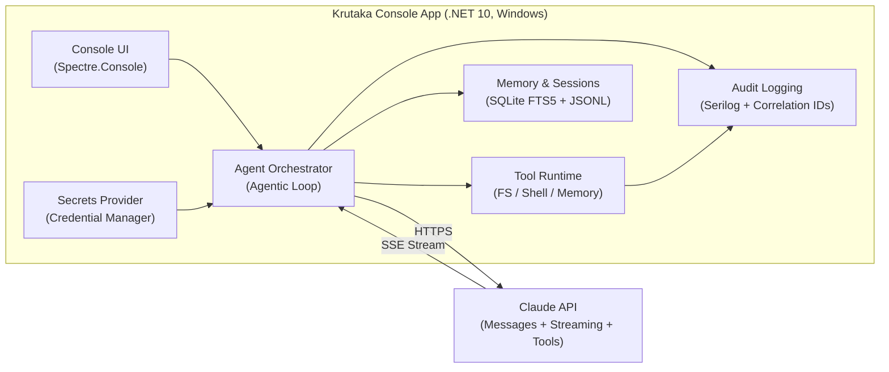

# Krutaka

[](https://github.com/chethandvg/krutaka/actions/workflows/build.yml)
[](https://github.com/chethandvg/krutaka/actions/workflows/security-tests.yml)

An OpenClaw-inspired AI agent built in C#/.NET 10 for Windows, powered by the Claude API. Krutaka is a local-first, security-hardened console agent that can read, write, search, and execute commands in your project — with human-in-the-loop approval for all destructive operations.

> **Status:** 🚧 Phase 6 — Build, Package & Verify. See [Progress Tracker](docs/status/PROGRESS.md).

## Why Krutaka?

OpenClaw demonstrated the power of agentic AI — and also its dangers. CVE-2026-25253 (RCE via exposed API), CVE-2026-25157 (command injection), and CVE-2026-24763 (sandbox escape) showed that security must be designed in from day one, not bolted on later.

Krutaka is built to avoid those mistakes:

- **No network listener** — Console-only, no HTTP/WebSocket surface. Eliminates the entire CVE-2026-25253 attack class.
- **DPAPI-encrypted secrets** — API keys stored in Windows Credential Manager, never in files or environment variables.
- **Mandatory human approval** — Write and execute operations require explicit user confirmation.
- **Command allowlisting** — Shell execution uses a strict allowlist enforced in code, not config.
- **Path sandboxing** — All file operations are jailed to the project directory with canonicalization and blocklists.
- **Prompt injection defense** — Untrusted content (file contents, command output) is tagged with XML delimiters and the model is instructed to treat it as data only.

## Architecture



### Solution Structure

```
Krutaka.sln
├── src/
│   ├── Krutaka.Core/          # Interfaces, models, orchestrator (zero dependencies)
│   ├── Krutaka.AI/            # Claude API client (official Anthropic package v12.4.0)
│   ├── Krutaka.Tools/         # Tool implementations + security policy
│   ├── Krutaka.Memory/        # SQLite FTS5 + session persistence
│   ├── Krutaka.Skills/        # Markdown skill loader (YAML frontmatter)
│   └── Krutaka.Console/       # Entry point + Spectre.Console UI
├── tests/
│   ├── Krutaka.Core.Tests/
│   ├── Krutaka.AI.Tests/
│   ├── Krutaka.Tools.Tests/   # Includes security test suite
│   └── Krutaka.Memory.Tests/
├── skills/                    # User-created skill files
├── prompts/                   # System prompt templates
└── docs/                      # Architecture and status documentation
```

## Key Technology Choices

| Component | Choice | Rationale |
|---|---|---|
| Runtime | .NET 10 LTS | Supported until Nov 2028. No support cliff pressure. |
| Claude SDK | Official `Anthropic` v12.4.0 (GA) | Vendor-backed, stable, streaming + tool use support. |
| Console UI | Spectre.Console 0.54.0 | Rich markup, panels, spinners, prompts. .NET Foundation project. |
| Database | SQLite via Microsoft.Data.Sqlite | FTS5 built-in, zero-config, local-only. |
| Process execution | CliWrap | Safe async execution, no string interpolation, argument arrays. |
| Secrets | Windows Credential Manager | DPAPI-backed encryption at rest. |
| Logging | Serilog | Structured JSON logging with correlation IDs. |

## Prerequisites

- Windows 10 22H2+ or Windows 11 (x64)
- [.NET 10 SDK](https://dotnet.microsoft.com/download/dotnet/10.0)
- Claude API key from [Anthropic Console](https://console.anthropic.com/)

## Quick Start

```bash
# Clone the repository
git clone https://github.com/chethandvg/krutaka.git
cd krutaka

# Build
dotnet build

# Run (first run will prompt for API key)
dotnet run --project src/Krutaka.Console

# Run tests
dotnet test

# Publish self-contained binary
dotnet publish src/Krutaka.Console -c Release -r win-x64 --self-contained -p:PublishSingleFile=true
```

## CI/CD & Downloads

Krutaka uses GitHub Actions for continuous integration:

- **Build & Test**: Runs on every push and PR to `main` ([View Workflow](https://github.com/chethandvg/krutaka/actions/workflows/build.yml))
  - Builds on Windows with .NET 10
  - Runs all 201 tests
  - Publishes self-contained win-x64 executable
  - Artifacts available for 90 days

- **Security Tests**: Runs 125 security-focused tests on every PR ([View Workflow](https://github.com/chethandvg/krutaka/actions/workflows/security-tests.yml))
  - Tests command validation, path sandboxing, environment scrubbing
  - Fails the build if any security test fails

**Download latest build**: Go to [Actions](https://github.com/chethandvg/krutaka/actions), select a successful workflow run, and download the `krutaka-win-x64` artifact.

## Documentation

| Document | Description |
|---|---|
| [Architecture Overview](docs/architecture/OVERVIEW.md) | Component map, project dependencies, technology choices |
| [Architecture Decisions](docs/architecture/DECISIONS.md) | ADR log — why each major choice was made |
| [Security Model](docs/architecture/SECURITY.md) | Threat model, security controls, policy rules |
| [Progress Tracker](docs/status/PROGRESS.md) | Phase/issue completion status |
| [Dependency Map](docs/status/DEPENDENCY-MAP.md) | NuGet package versions and purposes |
| [Local Setup Guide](docs/guides/LOCAL-SETUP.md) | Dev environment prerequisites and build instructions |
| [Testing Guide](docs/guides/TESTING.md) | Test strategy, how to run, security test corpus |

## Design References

- [Rough Outline](Rough_outline.md) — Original architecture blueprint with code patterns
- [Outline Gaps](Outline_gaps.md) — Gap analysis, risk assessment, and remediation plan

## License

MIT License — Copyright (c) 2026 Chethan. See [LICENSE](LICENSE).