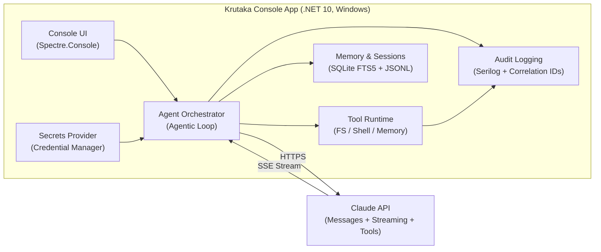

# Krutaka

[](https://github.com/chethandvg/krutaka/actions/workflows/build.yml)
[](https://github.com/chethandvg/krutaka/actions/workflows/security-tests.yml)

An OpenClaw-inspired AI agent built in C#/.NET 10 for Windows, powered by the Claude API. Krutaka is a local-first, security-hardened agent that can read, write, search, and execute commands in your project — with human-in-the-loop approval for all destructive operations. Access your agent via local console or remotely through Telegram.

> **Status:** ✅ v0.4.0 — Multi-session architecture with Telegram integration. 1,765 tests passing (2 skipped), ready for use. See [Progress Tracker](docs/status/PROGRESS.md).

## Why Krutaka?

OpenClaw demonstrated the power of agentic AI — and also its dangers. CVE-2026-25253 (RCE via exposed API), CVE-2026-25157 (command injection), and CVE-2026-24763 (sandbox escape) showed that security must be designed in from day one, not bolted on later.

Krutaka is built to avoid those mistakes:

- **No network listener** — Console-only by default, no HTTP/WebSocket surface. Eliminates the entire CVE-2026-25253 attack class.
- **Telegram bot interface (optional)** — Secure remote access via Telegram Bot API with user allowlist, rate limiting, and lockout protection.
- **Multi-session architecture** — Multiple users/chats can operate concurrently with full state isolation (directory grants, command approvals, conversation history).
- **DPAPI-encrypted secrets** — API keys stored in Windows Credential Manager, never in files or environment variables.
- **Mandatory human approval** — Write and execute operations require explicit user confirmation.
- **Command allowlisting** — Shell execution uses a strict allowlist enforced in code, not config.
- **Graduated command execution** — Commands classified into risk tiers (Safe/Moderate/Elevated/Dangerous) for context-appropriate approval instead of blanket prompting.
- **Dynamic directory scoping** — Multi-directory access with layered policy engine (hard deny → auto-grant → session grants → user prompts).
- **Path hardening** — Segment-by-segment symlink resolution, ADS blocking, device name blocking, ceiling enforcement.
- **Prompt injection defense** — Untrusted content (file contents, command output, Telegram messages) is tagged with XML delimiters and the model is instructed to treat it as data only.

## Architecture



### Solution Structure

```
Krutaka.slnx
├── src/
│   ├── Krutaka.Core/          # Interfaces, models, orchestrator (zero dependencies)
│   ├── Krutaka.AI/            # Claude API client (official Anthropic package v12.4.0)
│   ├── Krutaka.Tools/         # Tool implementations + security policy
│   ├── Krutaka.Memory/        # SQLite FTS5 + session persistence
│   ├── Krutaka.Skills/        # Markdown skill loader (YAML frontmatter)
│   ├── Krutaka.Console/       # Entry point + Spectre.Console UI
│   └── Krutaka.Telegram/      # Telegram Bot API integration
├── tests/
│   ├── Krutaka.Core.Tests/
│   ├── Krutaka.AI.Tests/
│   ├── Krutaka.Tools.Tests/   # Includes security test suite
│   ├── Krutaka.Memory.Tests/
│   ├── Krutaka.Skills.Tests/
│   ├── Krutaka.Console.Tests/
│   └── Krutaka.Telegram.Tests/
├── skills/                    # User-created skill files
├── prompts/                   # System prompt templates
└── docs/                      # Architecture and status documentation
```
```

## Key Technology Choices

| Component | Choice | Rationale |
|---|---|---|
| Runtime | .NET 10 LTS | Supported until Nov 2028. No support cliff pressure. |
| Claude SDK | Official `Anthropic` v12.4.0 (GA) | Vendor-backed, stable, streaming + tool use support. |
| Console UI | Spectre.Console 0.54.0 | Rich markup, panels, spinners, prompts. .NET Foundation project. |
| Database | SQLite via Microsoft.Data.Sqlite | FTS5 built-in, zero-config, local-only. |
| Process execution | CliWrap | Safe async execution, no string interpolation, argument arrays. |
| Secrets | Windows Credential Manager | DPAPI-backed encryption at rest. |
| Logging | Serilog | Structured JSON logging with correlation IDs. |

## Prerequisites

- Windows 10 22H2+ or Windows 11 (x64)
- [.NET 10 SDK](https://dotnet.microsoft.com/download/dotnet/10.0)
- Claude API key from [Anthropic Console](https://console.anthropic.com/)

## Quick Start

```bash
# Clone the repository
git clone https://github.com/chethandvg/krutaka.git
cd krutaka

# Build
dotnet build

# Run (first run will prompt for API key)
dotnet run --project src/Krutaka.Console

# Run tests
dotnet test

# Publish self-contained binary
dotnet publish src/Krutaka.Console -c Release -r win-x64 --self-contained -p:PublishSingleFile=true
```

## Telegram Setup (Optional)

Krutaka v0.4.0+ supports remote access via Telegram Bot API. This is completely optional — the local console works without any Telegram configuration.

**Quick setup:**
1. Create a bot with [@BotFather](https://t.me/BotFather) on Telegram
2. Store the bot token in Windows Credential Manager (see [Telegram Setup Guide](docs/guides/TELEGRAM-SETUP.md))
3. Get your Telegram User ID from [@userinfobot](https://t.me/userinfobot)
4. Add your User ID to `appsettings.json`:
   ```json
   "Telegram": {
     "AllowedUsers": [
       { "UserId": 123456789, "Role": "Admin" }
     ]
   }
   ```
5. Run in Telegram mode:
   ```bash
   dotnet run --project src/Krutaka.Console -- --mode telegram
   ```

📖 **Full instructions:** [docs/guides/TELEGRAM-SETUP.md](docs/guides/TELEGRAM-SETUP.md)

**Operating modes:**
- `Console` (default) — Local-only, no Telegram services loaded
- `Telegram` — Headless bot service, no console UI
- `Both` — Concurrent console + Telegram with shared session manager

## Available Commands

Once running, Krutaka provides the following commands:

| Command | Description |
|---|---|
| `/help` | Display available commands |
| `/sessions` | List recent sessions for this project (last 10) |
| `/new` | Start a fresh session (clears conversation history) |
| `/resume` | Reload current session from disk |
| `/exit` or `/quit` | Exit the application |
| `Ctrl+C` | Graceful shutdown |

**Session Management:**
- Krutaka automatically resumes your most recent session on startup
- Conversations are saved to `~/.krutaka/sessions/`
- Use `/sessions` to view past conversations
- Use `/new` to start a new session with cleared conversation history

## Documentation

| Document | Description |
|---|---|
| [Architecture Overview](docs/architecture/OVERVIEW.md) | Component map, project dependencies, technology choices |
| [Architecture Decisions](docs/architecture/DECISIONS.md) | ADR log — why each major choice was made |
| [Security Model](docs/architecture/SECURITY.md) | Threat model, security controls, policy rules |
| [Multi-Session Architecture](docs/architecture/MULTI-SESSION.md) | Session isolation design and per-session state |
| [Telegram Security](docs/architecture/TELEGRAM.md) | Telegram threat model and security boundaries |
| [Progress Tracker](docs/status/PROGRESS.md) | Phase/issue completion status |
| [Dependency Map](docs/status/DEPENDENCY-MAP.md) | NuGet package versions and purposes |
| [Local Setup Guide](docs/guides/LOCAL-SETUP.md) | Dev environment prerequisites and build instructions |
| [Telegram Setup Guide](docs/guides/TELEGRAM-SETUP.md) | Bot creation, token storage, configuration, troubleshooting |
| [Testing Guide](docs/guides/TESTING.md) | Test strategy, how to run, security test corpus |

## Security Posture

Krutaka implements defense-in-depth security controls to prevent the vulnerabilities found in OpenClaw:

### Implemented Security Controls

| Control | Implementation | Status |
|---|---|---|
| **Secrets Management** | Windows Credential Manager with DPAPI encryption | ✅ Complete |
| **Command Allowlist** | Tiered risk classification via `GraduatedCommandPolicy` (Safe/Moderate/Elevated/Dangerous) | ✅ Complete |
| **Path Validation** | Symlink resolution + ADS/device name blocking + ceiling enforcement | ✅ Complete |
| **Directory Access Control** | Layered policy engine with auto-grant patterns and session grants | ✅ Complete |
| **Multi-Session Isolation** | Per-session state for orchestrator, grants, approvals, conversation history | ✅ Complete |
| **Telegram Authentication** | User allowlist, rate limiting (10 cmd/min), lockout (3 attempts → 1 hour) | ✅ Complete |
| **Telegram Input Sanitization** | All messages wrapped in `<untrusted_content>` tags, Unicode normalization | ✅ Complete |
| **Callback Signature Validation** | HMAC-SHA256 signed inline keyboard callbacks, nonce-based replay prevention | ✅ Complete |
| **Process Sandboxing** | Windows Job Objects (256MB memory, 30s CPU limits) | ✅ Complete |
| **Human Approval** | Blocking approval for write/execute/directory access operations | ✅ Complete |
| **Environment Scrubbing** | Remove API keys/secrets from child processes | ✅ Complete |
| **Log Redaction** | Automatic API key scrubbing from all log output | ✅ Complete |
| **Prompt Injection Defense** | Untrusted content wrapped in XML tags | ✅ Complete |
| **Audit Logging** | Structured JSON logs with correlation IDs | ✅ Complete |

### Security Test Coverage

- **950+ security policy tests** covering:
  - 40 command validation tests (allowlist, blocklist, metacharacters)
  - 40 path validation tests (traversal, blocked directories, file patterns)
  - 20 environment scrubbing tests
  - 25 access policy engine tests (layer logic, deny precedence, grant flow)
  - 87 adversarial tests (symlink escapes, ADS attacks, device names, glob pattern abuse, ceiling violations)
  - ~370 graduated command execution tests (tier classification, policy evaluation, config validation, adversarial scenarios)
  - ~123 session isolation tests (per-session state, no leakage between sessions)
  - ~245 Telegram security tests (auth guard, rate limiting, lockout, callback signing, input sanitization)
- **All security tests passing** in CI/CD pipeline
- **Separate security test workflow** for critical security validations

### Threat Model

Krutaka addresses the following threats identified in OpenClaw CVEs:

| Threat | OpenClaw CVE | Mitigation | Validation |
|---|---|---|---|
| RCE via exposed API | CVE-2026-25253 | No network listener (console-only) | Architecture decision |
| Command injection | CVE-2026-25157 | CliWrap + argument arrays, metacharacter detection | 40 tests |
| Sandbox escape | CVE-2026-24763 | Path canonicalization + project root jail | 40 tests |
| Credential theft | CVE-2026-25253 | DPAPI encryption, never in files/env vars | Design + tests |
| Prompt injection | Common AI risk | XML tagging + system prompt instructions | Documentation |

For detailed threat model and security policy rules, see [docs/architecture/SECURITY.md](docs/architecture/SECURITY.md).

## Contributing

Contributions are welcome! Please follow these guidelines:

### Before Contributing

1. **Read the architecture documentation:**
   - [docs/architecture/OVERVIEW.md](docs/architecture/OVERVIEW.md) — Component structure
   - [docs/architecture/SECURITY.md](docs/architecture/SECURITY.md) — Security model
   - [docs/architecture/DECISIONS.md](docs/architecture/DECISIONS.md) — Design rationale
   - [AGENTS.md](AGENTS.md) — Agent instructions and coding standards

2. **Understand the security rules** (see [docs/architecture/SECURITY.md](docs/architecture/SECURITY.md)):
   - Never hardcode secrets
   - Always validate directory access through `IAccessPolicyEngine.EvaluateAsync()`
   - Always validate paths through `PathResolver.ResolveToFinalTarget()`
   - Always validate commands through `ICommandPolicy.EvaluateAsync()` for tier-based approval
   - Use CliWrap with explicit argument arrays (never string interpolation)
   - Wrap untrusted content in `<untrusted_content>` tags

### Development Setup

```bash
# Clone and build
git clone https://github.com/chethandvg/krutaka.git
cd krutaka
dotnet build

# Run tests
dotnet test

# Format code
dotnet format
```

### Coding Standards

- **Target:** .NET 10, C# 13 (`LangVersion latest`)
- **Nullable reference types:** Enabled globally
- **Warnings as errors:** All warnings must be resolved
- **Naming:** PascalCase for public, `_camelCase` for private fields
- **Async:** All I/O methods must be async with `CancellationToken`
- See [.github/copilot-instructions.md](.github/copilot-instructions.md) for complete conventions

### Pull Request Guidelines

1. **Fork the repository** and create a feature branch
2. **Write tests** for new functionality (use xUnit + FluentAssertions)
3. **Run security tests:** `dotnet test --filter "FullyQualifiedName~SecurityPolicy|FullyQualifiedName~SecurityViolationLogging"`
4. **Ensure all tests pass:** `dotnet test`
5. **Format code:** `dotnet format`
6. **Update documentation** if you change architecture or add features
7. **Submit PR** with clear description of changes

### Security Policy

If you discover a security vulnerability:

1. **DO NOT** open a public issue
2. Email the maintainer directly (see GitHub profile)
3. Provide detailed description and reproduction steps
4. Wait for response before public disclosure

### Code of Conduct

- Be respectful and inclusive
- Focus on constructive feedback
- Assume good intent

## Design References

- [Rough Outline](Rough_outline.md) — Original architecture blueprint with code patterns
- [Outline Gaps](Outline_gaps.md) — Gap analysis, risk assessment, and remediation plan

## License

MIT License — Copyright (c) 2026 Chethan D V G. See [LICENSE](LICENSE).

## Acknowledgments

- Inspired by OpenClaw and its security lessons
- Built with the official [Anthropic Claude API](https://www.anthropic.com/api)
- Uses [Spectre.Console](https://spectreconsole.net/) for rich terminal UI
- Security controls informed by OWASP and Microsoft SDL practices
