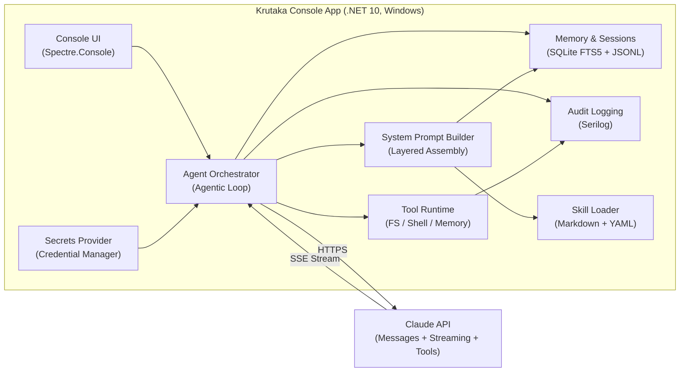
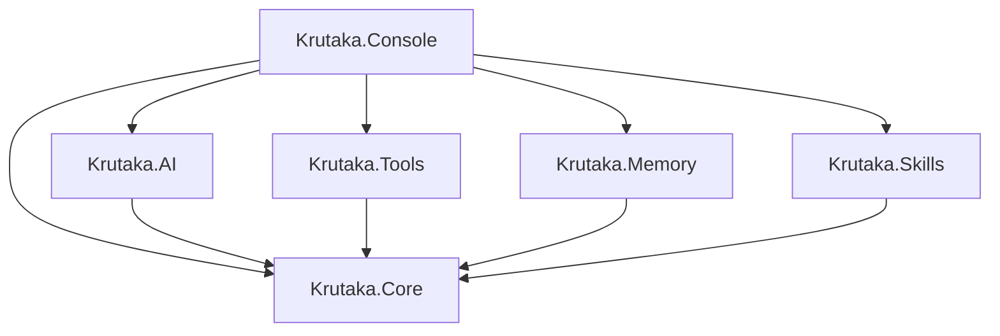
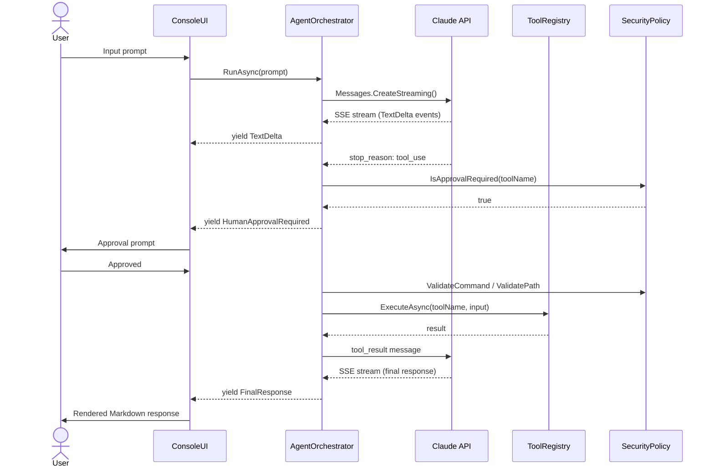

# Krutaka — Architecture Overview

> **Last updated:** 2026-02-10 (Issue #12 fully complete — RunCommandTool with Job Object sandboxing)

## System Architecture



## Component Map

### Krutaka.Core (net10.0)
**Status:** Interfaces, model types, and AgentOrchestrator complete (Issues #6, #14 — 2026-02-10)  
**Path:** `src/Krutaka.Core/`  
**Dependencies:** None (zero NuGet packages)

The shared contract layer. Defines all interfaces that other projects implement, all model types used across the solution, and the core agentic loop orchestrator.

#### Core Interfaces

| Interface | Description | Key Methods |
|---|---|---|
| `ITool` | Tool abstraction for AI agent | Name, Description, InputSchema, ExecuteAsync |
| `IToolRegistry` | Tool collection and dispatch | Register, GetToolDefinitions, ExecuteAsync |
| `IClaudeClient` | Claude API abstraction | SendMessageAsync (streaming), CountTokensAsync |
| `IMemoryService` | Hybrid search and storage | HybridSearchAsync, StoreAsync, ChunkAndIndexAsync |
| `ISessionStore` | JSONL session persistence | AppendAsync, LoadAsync, ReconstructMessagesAsync |
| `ISecurityPolicy` | Security policy enforcement | ValidatePath, ValidateCommand, ScrubEnvironment, IsApprovalRequired |

#### Model Types

| Type | Kind | Description |
|---|---|---|
| `ToolBase` | Abstract Class | Base class with BuildSchema helper for JSON Schema generation |
| `AgentEvent` | Abstract Record | Base for event hierarchy (TextDelta, ToolCallStarted/Completed/Failed, HumanApprovalRequired, FinalResponse) |
| `SessionEvent` | Record | JSONL event: Type, Role, Content, Timestamp, ToolName, ToolUseId, IsMeta |
| `MemoryResult` | Record | Search result: Id, Content, Source, CreatedAt, Score |
| `AgentConfiguration` | Record | Configuration: ModelId, MaxTokens, Temperature, approval preferences, directory paths |
| `AgentOrchestrator` | Sealed Class | Core agentic loop orchestrator implementing Pattern A (manual loop with full control) |

#### AgentOrchestrator Implementation

**Status:** ✅ Complete (Issue #14 — 2026-02-10)

The `AgentOrchestrator` implements the core agentic loop with the following features:

- **Pattern A implementation**: Manual loop with full control for transparency, audit logging, and human-in-the-loop approvals
- **Streaming support**: Yields `IAsyncEnumerable<AgentEvent>` for real-time progress tracking
- **Tool execution**: Processes tool calls from Claude, enforces security policies, and manages tool results
- **Tool-result ordering invariants**: Ensures tool result blocks are correctly formatted and ordered per Claude API requirements:
  - Tool result blocks must come first in user messages
  - Every tool_result references a valid tool_use.Id
  - Exactly N results for N tool-use requests
- **Error handling**: Tool failures return IsError=true results to Claude without crashing the loop
- **Timeout enforcement**: Configurable per-tool timeout (default: 30 seconds)
- **Human approval**: Yields HumanApprovalRequired events for tools requiring approval
- **Turn serialization**: Uses `SemaphoreSlim(1,1)` to serialize concurrent turn execution
- **Conversation management**: Maintains conversation history for multi-turn interactions

**Key Methods:**
- `RunAsync(userPrompt, systemPrompt, cancellationToken)`: Main entry point for agentic loop
- `ApproveTool(toolUseId, alwaysApprove)`: Approves pending tool execution
- `ConversationHistory`: Read-only access to conversation state

### Krutaka.AI (net10.0)
**Status:** Implemented (Issue #8 — 2026-02-10)  
**Path:** `src/Krutaka.AI/`  
**Dependencies:** Krutaka.Core, official Anthropic package (v12.4.0), Microsoft.Extensions.Http.Resilience

Claude API integration layer.

| Type | Description | Status |
|---|---|---|
| `ClaudeClientWrapper` | Wraps official Anthropic package behind `IClaudeClient` | ✅ Implemented |
| `ServiceExtensions` | `AddClaudeAI(services, config)` DI registration | ✅ Implemented |

**Implementation Details:**
- Uses official Anthropic C# package v12.4.0 (NuGet: `Anthropic`) for all API calls
- Streaming support via `IAsyncEnumerable<AgentEvent>` (basic implementation, to be enhanced in agentic loop)
- Token counting via `Messages.CountTokens()` endpoint ✅ Implemented
- HTTP resilience configured via official package's built-in retry mechanism:
  - Package MaxRetries set to 3 (exponential backoff with jitter)
  - Request timeout set to 120 seconds
  - Additional resilience configuration available for future extensibility
- Circuit breaker configuration available (30s sampling window, minimum 5 requests, 30s break duration)
- Request-id logging planned for future implementation
- API key retrieved from `ISecretsProvider` with fallback to configuration for testing

**Resilience pipeline:** Official package's built-in exponential backoff retry (3 attempts), 120s request timeout. Additional HTTP resilience pipeline configured for potential future use.

**Note:** We use the official `Anthropic` package (v12.4.0), NOT the community `Anthropic.SDK` package.

### Krutaka.Tools (net10.0-windows)
**Status:** ToolRegistry and DI registration complete (Issue #13 — 2026-02-10), run_command tool fully implemented (Issue #12 — 2026-02-10), Write tools implemented (Issue #11 — 2026-02-10), Read-only tools implemented (Issue #10 — 2026-02-10), CommandPolicy and SafeFileOperations complete (Issue #9 — 2026-02-10)  
**Path:** `src/Krutaka.Tools/`  
**Dependencies:** Krutaka.Core, CliWrap, Meziantou.Framework.Win32.Jobs

Tool implementations with security policy enforcement.

| Type | Risk Level | Approval | Status |
|---|---|---|---|
| `ReadFileTool` | Low | Auto-approve | ✅ Implemented |
| `ListFilesTool` | Low | Auto-approve | ✅ Implemented |
| `SearchFilesTool` | Low | Auto-approve | ✅ Implemented |
| `WriteFileTool` | High | Required | ✅ Implemented |
| `EditFileTool` | High | Required | ✅ Implemented |
| `RunCommandTool` | Critical | Always required | ✅ Fully Implemented |
| `MemoryStoreTool` | Medium | Auto-approve | Not Started |
| `MemorySearchTool` | Low | Auto-approve | Not Started |
| `CommandPolicy` | — | Allowlist/blocklist enforcement | ✅ Implemented |
| `SafeFileOperations` | — | Path canonicalization + jail | ✅ Implemented |
| `EnvironmentScrubber` | — | Strips secrets from child process env | ✅ Implemented |
| `ToolRegistry` | — | Collection + dispatch | ✅ Implemented |
| `ToolOptions` | — | Configuration for tool execution | ✅ Implemented |
| `ServiceExtensions` | — | DI registration via `AddAgentTools()` | ✅ Implemented |

**Implemented Tools Details:**
- **ReadFileTool**: Reads file contents with path validation and 1MB size limit. Wraps output in `<untrusted_content>` tags for prompt injection defense.
- **ListFilesTool**: Lists files matching glob patterns recursively. Validates all paths and filters blocked files/directories.
- **SearchFilesTool**: Grep-like text/regex search across files. Supports case-sensitive/insensitive matching, file pattern filtering, and returns results with file path and line number.
- **WriteFileTool**: Creates or overwrites files with security validation. Creates parent directories if needed. Backs up existing files before overwriting. Requires human approval.
- **EditFileTool**: Edits files by replacing content in a specific line range (1-indexed). Creates backups before editing. Returns a diff showing changes. Requires human approval.
- **RunCommandTool**: Executes shell commands with full security controls and sandboxing:
  - **Command validation**: Allowlist/blocklist enforcement, shell metacharacter detection
  - **Environment scrubbing**: Removes sensitive variables (*_KEY, *_SECRET, *_TOKEN, ANTHROPIC_*, etc.)
  - **Job Object sandboxing** (Windows only): 256 MB memory limit, 30-second CPU time limit, kill-on-job-close
  - **Timeout enforcement**: 30-second hard limit via `CancellationTokenSource` (all platforms)
  - **Implementation**: Uses CliWrap's `ExecuteAsync` (streaming API) with `PipeTarget.ToStringBuilder` to capture output while accessing ProcessId for Job Object assignment
  - **Platform-aware**: Job Objects active on Windows, graceful fallback on other platforms
  - **Requires human approval** for every invocation (no "Always allow" option)
  - Captures stdout/stderr with clear labeling and exit codes

**Tool Registry & DI:**
- **ToolRegistry**: Centralized collection of all tools with:
  - `Register(ITool tool)`: Adds tools to the registry (case-insensitive lookup)
  - `GetToolDefinitions()`: Returns tool definitions in Claude API format (name, description, input_schema)
  - `ExecuteAsync(string name, JsonElement input, CancellationToken)`: Dispatches tool execution by name
  - Throws `InvalidOperationException` for unknown tool names
- **ToolOptions**: Configuration class with:
  - `WorkingDirectory`: Root directory for file/command operations (defaults to current directory)
  - `CommandTimeoutSeconds`: Timeout for command execution (defaults to 30 seconds)
  - `RequireApprovalForWrites`: Whether write operations require human approval (defaults to true)
- **ServiceExtensions.AddAgentTools()**: DI registration method that:
  - Registers `ToolOptions` as singleton
  - Registers `CommandPolicy` as `ISecurityPolicy` singleton
  - Registers `ToolRegistry` as `IToolRegistry` singleton
  - Instantiates and registers all 6 tool implementations
  - Automatically adds all tools to the registry
  - Accepts optional `Action<ToolOptions>` for configuration

### Krutaka.Memory (net10.0)
**Status:** Scaffolded (Issue #5)  
**Path:** `src/Krutaka.Memory/`  
**Dependencies:** Krutaka.Core, Microsoft.Data.Sqlite

Persistence layer for sessions, memory search, and daily logs.

| Type | Description |
|---|---|
| `SessionStore` | JSONL session files under `~/.krutaka/sessions/` |
| `SqliteMemoryStore` | FTS5 keyword search + (future) vector search |
| `TextChunker` | Split text into ~500 token chunks with overlap |
| `MemoryFileService` | MEMORY.md read/update |
| `DailyLogService` | Daily log append + indexing |
| `HybridSearchService` | (Future v2) RRF fusion of FTS5 + vector |
| `ServiceExtensions` | `AddMemory(services, options)` DI registration |

### Krutaka.Skills (net10.0)
**Status:** Scaffolded (Issue #5)  
**Path:** `src/Krutaka.Skills/`  
**Dependencies:** Krutaka.Core, YamlDotNet

Markdown-based skill system.

| Type | Description |
|---|---|
| `SkillRegistry` | Metadata loading + full content on demand |
| `SkillLoader` | YAML frontmatter parser |
| `SkillMetadata` | Name, Description, FilePath, AllowedTools, Model, Version |
| `ServiceExtensions` | `AddSkills(services, options)` DI registration |

### Krutaka.Console (net10.0-windows)
**Status:** Scaffolded (Issue #5)  
**Path:** `src/Krutaka.Console/`  
**Dependencies:** All Krutaka projects, Spectre.Console, Markdig, Serilog, Meziantou CredentialManager

Entry point and console UI.

| Type | Description |
|---|---|
| `Program` | Composition root, DI wiring, main loop |
| `ConsoleUI` | Streaming display, input prompt, tool indicators |
| `MarkdownRenderer` | Markdig AST → Spectre.Console markup |
| `ApprovalHandler` | Human-in-the-loop approval prompts |
| `SetupWizard` | First-run API key configuration |
| `SecretsProvider` | Windows Credential Manager read/write |

## Project Dependency Graph



**Rule:** Core has no project references. AI, Tools, Memory, Skills reference only Core. Console references all.

## Data Flow: Agent Turn



## Storage Layout

```
~/.krutaka/
├── config.json                         # Global settings
├── MEMORY.md                           # Curated persistent memory
├── memory.db                           # SQLite (FTS5 + future vectors)
├── logs/
│   ├── 2026-02-10.md                   # Daily interaction log
│   └── audit-2026-02-10.json           # Structured audit log (Serilog)
├── sessions/
│   └── C-Users-chethandvg-project/     # Path-encoded project directory
│       ├── {guid}.jsonl                # Session events
│       └── {guid}.meta.json            # Session metadata
└── skills/                             # User-installed skills
    └── code-reviewer/SKILL.md
```