# Krutaka v0.2.0 — Dynamic Directory Scoping

> **Version:** v0.2.0  
> **Status:** 🟡 Planning  
> **Planned Start:** 2026-02-12  
> **Predecessor:** v0.1.0 (✅ Complete — 576 tests, all core features)  
> **Milestone:** [v0.2.0](https://github.com/chethandvg/krutaka/milestones/1)

---

## Table of Contents

- [Executive Summary](#executive-summary)
- [Problem Statement](#problem-statement)
- [Goals and Non-Goals](#goals-and-non-goals)
- [Architecture Design](#architecture-design)
  - [Current State (v0.1.0)](#current-state-v010)
  - [Target State (v0.2.0)](#target-state-v020)
  - [Four-Layer Policy Engine](#four-layer-policy-engine)
  - [Session-Scoped Access Grants](#session-scoped-access-grants)
  - [Component Diagram](#component-diagram)
  - [Data Flow: Directory Access Request](#data-flow-directory-access-request)
- [Security Analysis](#security-analysis)
  - [Threat Model](#threat-model)
  - [Attack Surface Changes](#attack-surface-changes)
  - [Immutable Security Boundaries](#immutable-security-boundaries)
  - [New Attack Vectors and Mitigations](#new-attack-vectors-and-mitigations)
  - [TOCTOU Analysis](#toctou-analysis)
  - [Symlink and Junction Security](#symlink-and-junction-security)
  - [Glob Pattern Abuse Prevention](#glob-pattern-abuse-prevention)
  - [Session Scope Accumulation Defense](#session-scope-accumulation-defense)
- [Configuration Model](#configuration-model)
- [Implementation Roadmap](#implementation-roadmap)
  - [Issue Dependency Graph](#issue-dependency-graph)
  - [Issue Summary Table](#issue-summary-table)
- [Testing Strategy](#testing-strategy)
- [Rollback Plan](#rollback-plan)
- [Risks and Mitigations](#risks-and-mitigations)
- [Success Criteria](#success-criteria)
- [Related Documents](#related-documents)

---

## Executive Summary

v0.2.0 replaces the static, single-directory `WorkingDirectory` configuration with a **dynamic, session-scoped directory access model**. The agent can request access to multiple directories at runtime. A four-layer policy engine evaluates every request: hard deny-list → configurable allow-list → session grants → heuristic checks. This removes the biggest usability friction in v0.1.0 while preserving (and strengthening) all security guarantees.

---

## Problem Statement

### Current Limitation (v0.1.0)

In v0.1.0, the agent operates in exactly **one directory**, declared upfront in `appsettings.json` via `ToolOptions.WorkingDirectory`. This creates serious friction:

1. **Monorepo users** cannot work across multiple subdirectories without restarting
2. **Multi-project workflows** (e.g., editing both a library and its consumer) require separate sessions
3. **Exploratory tasks** (e.g., "find the config file somewhere under my home directory") are blocked
4. The directory must be known *before* starting the agent — the agent cannot discover it

### Root Cause

`ToolOptions.WorkingDirectory` is a **singleton string** injected at DI registration time. Every tool receives the same static root. There is no mechanism to request, evaluate, or grant access to additional directories during a session.

### Impact

Users work around this by setting `WorkingDirectory` to a very broad path (e.g., `C:\Users\username`), which defeats the sandboxing purpose. Or they restart the agent for each project, losing session context.

---

## Goals and Non-Goals

### Goals

| # | Goal | Rationale |
|---|------|-----------|
| G1 | Agent can access multiple directories in a single session | Core user need |
| G2 | Every directory access is evaluated by a policy engine | Security requirement |
| G3 | System directories remain unconditionally blocked | Immutable security boundary |
| G4 | Users can approve/deny/downgrade directory access interactively | Human-in-the-loop |
| G5 | Frequently-used paths can be auto-approved via glob patterns | Reduce approval fatigue |
| G6 | Session grants expire via TTL | Prevent stale permission accumulation |
| G7 | Symlinks and junctions are resolved before policy evaluation | Close v0.1.0 security gap |
| G8 | All v0.1.0 tests continue to pass | Backward compatibility |
| G9 | 65+ new tests covering adversarial security scenarios | Prove the new model is safe |

### Non-Goals (deferred to v0.3.0+)

| # | Non-Goal | Why Deferred |
|---|----------|-------------|
| NG1 | Graduated command execution (risk tiers) | Separate concern, v0.3.0 |
| NG2 | Telegram integration | Remote attack surface, v0.4.0 |
| NG3 | Autonomous agent mode | Requires v0.2.0 + v0.3.0 foundation |
| NG4 | Cross-platform support (Linux/macOS) | Windows-first per ADR-005 |
| NG5 | Per-file granular permissions | Excessive complexity for v0.2.0 |

---

## Architecture Design

### Current State (v0.1.0)

```
appsettings.json
  └── ToolOptions.WorkingDirectory: "C:\Projects\MyApp"  ← locked at startup

All tools receive this single string via DI constructor injection.
SafeFileOperations.ValidatePath() checks: resolvedPath.StartsWith(projectRoot)
```

**Key classes:**
- `ToolOptions.WorkingDirectory` — static string, set once
- `SafeFileOperations.ValidatePath(path, projectRoot)` — validates containment
- `CommandPolicy.ValidatePath(path)` — delegates to SafeFileOperations
- All 6 tools receive `_projectRoot` in constructor

### Target State (v0.2.0)

```
Session starts
  → Agent requests access to directory (tool invocation triggers it)
  → LayeredAccessPolicyEngine evaluates request through 4 layers
  → Grant/Deny with scoped path and optional TTL
  → Tool proceeds with validated ScopedPath

Multiple directories can be active simultaneously within one session.
```

**New classes:**
- `IAccessPolicyEngine` — interface in `Krutaka.Core`
- `LayeredAccessPolicyEngine` — implementation in `Krutaka.Tools`
- `ISessionAccessStore` — interface in `Krutaka.Core`
- `InMemorySessionAccessStore` — implementation in `Krutaka.Tools`
- `PathResolver` — symlink/junction resolution in `Krutaka.Tools`
- `GlobPatternValidator` — pattern validation in `Krutaka.Tools`
- `DirectoryAccessRequested` — agent event in `Krutaka.Core`

### Four-Layer Policy Engine

The `LayeredAccessPolicyEngine` evaluates directory access requests through four ordered layers. **A deny at any layer is final — no later layer can override it.**

```
Request: DirectoryAccessRequest(Path, AccessLevel, Justification)
         │
         ▼
┌─────────────────────────────────────────────────────┐
│ Layer 1: HARD DENY LIST (Immutable — never changes) │
│                                                     │
│ • C:\Windows, C:\Program Files, System32, SysWOW64  │
│ • %APPDATA%, %LOCALAPPDATA%                         │
│ • %USERPROFILE%\.krutaka (agent's own config)       │
│ • UNC paths (\\server\share\...)                    │
│ • Paths above ceiling directory                     │
│ • Paths with ADS, device names, device prefixes     │
│                                                     │
│ DENY → AccessDecision(Granted: false, Reason)       │
│ PASS → Continue to Layer 2                          │
└─────────────────────────────────────────────────────┘
         │
         ▼
┌─────────────────────────────────────────────────────┐
│ Layer 2: CONFIGURABLE ALLOW LIST (Glob patterns)    │
│                                                     │
│ • Patterns from appsettings.json AutoGrantPatterns   │
│ • e.g., "C:\Users\chethan\Projects\**"              │
│ • Validated at startup (overly-broad rejected)       │
│                                                     │
│ MATCH → AccessDecision(Granted: true, AutoGrant)    │
│ NO MATCH → Continue to Layer 3                      │
└─────────────────────────────────────────────────────┘
         │
         ▼
┌─────────────────────────────────────────────────────┐
│ Layer 3: SESSION GRANTS (Previously approved)       │
│                                                     │
│ • Check ISessionAccessStore for active grant        │
│ • Verify AccessLevel is sufficient                  │
│ • Check TTL hasn't expired                          │
│ • Automatic pruning of expired grants               │
│                                                     │
│ GRANTED → AccessDecision(Granted: true, Session)    │
│ NOT FOUND → Continue to Layer 4                     │
└─────────────────────────────────────────────────────┘
         │
         ▼
┌─────────────────────────────────────────────────────┐
│ Layer 4: HEURISTIC CHECKS + USER PROMPT             │
│                                                     │
│ • Cross-volume detection (different drive letter)    │
│ • Path depth heuristics (very deep nesting)          │
│ • Flag suspicious patterns for human review          │
│                                                     │
│ Result: NEEDS_APPROVAL (trigger interactive prompt)  │
│    or   DENY (heuristic hard-deny)                  │
└─────────────────────────────────────────────────────┘
```

### Session-Scoped Access Grants

```
SessionAccessGrant:
  ├── Path: string (canonical, resolved)
  ├── AccessLevel: ReadOnly | ReadWrite | Execute
  ├── GrantedAt: DateTimeOffset
  ├── ExpiresAt: DateTimeOffset? (null = session lifetime)
  ├── Justification: string
  └── GrantedBy: User | AutoGrant | Policy

InMemorySessionAccessStore:
  ├── Thread-safe (ConcurrentDictionary)
  ├── Max concurrent grants: 10 (configurable)
  ├── Automatic TTL pruning before each IsGrantedAsync check
  ├── AccessLevel enforcement (ReadOnly grant ≠ ReadWrite access)
  └── Cleared on session end
```

### Component Diagram


### Data Flow: Directory Access Request

```mermaid
sequenceDiagram
    actor User
    participant Tool as ReadFileTool
    participant Engine as LayeredAccessPolicyEngine
    participant L1 as Layer 1: Hard Deny
    participant L2 as Layer 2: Glob Allow
    participant L3 as Layer 3: Session Grants
    participant L4 as Layer 4: Heuristics
    participant UI as ApprovalHandler
    participant Store as SessionAccessStore

    Tool->>Engine: EvaluateAsync(path, ReadOnly, "reading config")
    Engine->>L1: Check hard deny list
    L1-->>Engine: PASS

    Engine->>L2: Check glob patterns
    L2-->>Engine: NO MATCH

    Engine->>L3: Check session grants
    L3->>Store: IsGrantedAsync(path, ReadOnly)
    Store-->>L3: NOT FOUND
    L3-->>Engine: NOT FOUND

    Engine->>L4: Heuristic checks
    L4-->>Engine: NEEDS_APPROVAL

    Engine-->>Tool: AccessDecision(NeedsApproval)
    Tool-->>UI: yield DirectoryAccessRequested

    UI->>User: "Allow access to C:\Other\Project? [Y/R/N/S]"
    User->>UI: [S] Allow for session

    UI->>Store: GrantAccessAsync(path, ReadOnly, sessionTTL)
    Store-->>UI: Granted

    UI-->>Tool: Approved
    Tool->>Engine: EvaluateAsync(path, ReadOnly, "reading config")
    Note over Engine,L3: Second call — Layer 3 finds session grant
    Engine-->>Tool: AccessDecision(Granted, ScopedPath)
    Tool->>Tool: Proceed with file read
```



---

## Security Analysis

### Threat Model

| # | Threat | Severity | Attack Vector | Mitigation | Layer |
|---|--------|----------|---------------|------------|-------|
| T1 | Agent social engineering | High | Agent crafts persuasive justification to access system dirs | Hard deny list is non-negotiable — no justification overrides Layer 1 | L1 |
| T2 | Symlink escape | Critical | Create symlink in allowed dir pointing to blocked dir | `PathResolver` resolves all symlinks to final target before evaluation | L1 |
| T3 | TOCTOU race | Medium | Path changes between validation and access | Resolve path at validation AND re-validate at access time | L1+Tool |
| T4 | Session scope accumulation | Medium | Gradually request access to broad dirs over many turns | Max concurrent grants (10), TTL expiry, ceiling enforcement | L3 |
| T5 | Path traversal via request | Critical | Request path with `..` segments to escape ceiling | `Path.GetFullPath()` canonicalization + ceiling check on resolved path | L1 |
| T6 | Glob pattern abuse | High | Configure `C:\**` as auto-grant pattern | Startup validation rejects patterns < 3 segments, containing blocked dirs | L2 |
| T7 | Cross-volume bypass | Medium | Request access to D: drive when ceiling is C: | Cross-volume detection in Layer 4, requires explicit approval | L4 |
| T8 | ADS hidden data | Medium | Access `file.txt:hidden` alternate data stream | Block `:` after drive letter position in all paths | L1 |
| T9 | Device name abuse | Medium | Access `CON`, `NUL`, `COM1` as file paths | Block all reserved Windows device names | L1 |
| T10 | Unicode confusable | Low | Use Unicode characters that look like path separators | Normalize and validate after canonicalization | L1 |
| T11 | Null byte injection | Critical | Embed `\0` in path string to truncate validation | Reject any path containing null bytes | L1 |
| T12 | Junction point escape | Critical | Create NTFS junction in allowed dir pointing to system dir | `PathResolver` resolves junctions via `ResolveLinkTarget` | L1 |
| T13 | Max-length path | Low | Submit path > 260 chars to trigger edge cases | Handle gracefully (use long path APIs or return clear error) | L1 |
| T14 | Rapid-fire accumulation | Medium | Request many dirs quickly to accumulate broad scope | Max 10 concurrent grants, TTL enforcement | L3 |
| T15 | AccessLevel escalation | Medium | Granted ReadOnly, attempt ReadWrite operation | Strict level checking: granted level must be ≥ requested level | L3 |

### Attack Surface Changes

```
v0.1.0 Attack Surface:
  ├── Static directory → fixed at startup
  ├── Path traversal → blocked by SafeFileOperations
  ├── System dirs → blocked by SafeFileOperations
  └── Symlinks → ⚠️ NOT RESOLVED (security gap)

v0.2.0 Attack Surface (changes in bold):
  ├── **Dynamic directory requests → evaluated by 4-layer engine**
  ├── Path traversal → blocked by SafeFileOperations + **canonicalization before engine**
  ├── System dirs → blocked by **Layer 1 hard deny (expanded list)**
  ├── Symlinks → **RESOLVED by PathResolver before evaluation**
  ├── **Glob patterns → validated at startup, abuse patterns rejected**
  ├── **Session grants → TTL-bounded, max-count-limited, level-enforced**
  ├── **ADS → blocked by PathResolver**
  ├── **Device names → blocked by PathResolver**
  └── **Cross-volume → flagged by Layer 4 heuristics**
```

### Immutable Security Boundaries

These properties are **guaranteed in v0.1.0 and remain guaranteed in v0.2.0**. They are not configurable.

1. **System directory blocking** — `C:\Windows`, `C:\Program Files`, `System32`, etc. are ALWAYS blocked
2. **Path traversal protection** — `..` segments are resolved before evaluation, never trusted
3. **UNC path blocking** — `\\server\share\...` is ALWAYS blocked
4. **Secret redaction in logs** — `sk-ant-*` and credential patterns are ALWAYS redacted
5. **Untrusted content tagging** — File/command output is ALWAYS wrapped in XML tags
6. **Command injection prevention** — CliWrap argument arrays are ALWAYS used, metacharacters ALWAYS blocked
7. **CancellationToken on everything** — All async operations respect cancellation
8. **Sensitive file pattern blocking** — `.env`, `.key`, `.pem`, etc. are ALWAYS blocked
9. **Agent config self-protection** — `~/.krutaka/` is ALWAYS blocked from agent access
10. **Human approval for run_command** — ALWAYS required, no "Always" option, no bypass

### New Attack Vectors and Mitigations

#### T2: Symlink Escape (CRITICAL — closing v0.1.0 gap)

**Attack:** Attacker creates `C:\Projects\MyApp\link` → `C:\Windows\System32`

**v0.1.0 behavior:** `Path.GetFullPath("link\cmd.exe")` returns `C:\Projects\MyApp\link\cmd.exe` which passes `StartsWith(projectRoot)` check. The actual file accessed is `C:\Windows\System32\cmd.exe`.

**v0.2.0 mitigation:**
1. `PathResolver.ResolveToFinalTarget(path)` uses `FileSystemInfo.ResolveLinkTarget(returnFinalTarget: true)`
2. Resolution happens BEFORE the `StartsWith(root)` containment check
3. Resolved target `C:\Windows\System32\cmd.exe` fails Layer 1 hard deny
4. For non-existent paths (e.g., new file creation), validate the parent directory chain

#### T3: TOCTOU (Time-of-Check-to-Time-of-Use)

**Attack:** Path is valid symlink at validation time, then changed to point to system dir before the tool reads it.

**Mitigation:**
- Re-resolve at access time (SafeFileOperations calls PathResolver on every operation, not just the first)
- The window is very small (milliseconds between resolve and File.Read), and requires the attacker to have filesystem write access to the allowed directory — which means they already have the access they're trying to gain
- Defense-in-depth: Even if TOCTOU succeeds, Job Object sandboxing limits damage for command execution

#### T6: Glob Pattern Abuse

**Attack:** User (or compromised config file) sets `AutoGrantPatterns: ["C:\**"]`

**Mitigation (startup validation in `GlobPatternValidator`):**
- Pattern must have ≥ 3 path segments (e.g., `C:\Users\name\...` — not `C:\**`)
- Pattern must not contain any blocked directory from `SafeFileOperations`
- Pattern must be under the configured ceiling directory
- Overly-broad patterns (< 4 segments) generate a log warning even if allowed
- Empty, null, or whitespace patterns are rejected

### TOCTOU Analysis

| Operation | Time-of-Check | Time-of-Use | Window | Risk | Mitigation |
|-----------|---------------|-------------|--------|------|------------|
| File read | PathResolver → Engine eval | File.ReadAllTextAsync | ~1ms | Low | Re-resolve at access |
| File write | PathResolver → Engine eval → Approval | File.WriteAllTextAsync | ~100ms (human approval) | Medium | Re-resolve after approval, before write |
| Command exec | PathResolver → Engine eval → Approval | CliWrap.ExecuteAsync | ~100ms | Medium | Re-validate working directory, Job Object limits damage |

### Symlink and Junction Security

| Scenario | PathResolver Behavior | Result |
|----------|----------------------|--------|
| Regular file in allowed dir | Returns same path | ✅ Allowed |
| Symlink in allowed dir → allowed target | Returns resolved target | ✅ Allowed |
| Symlink in allowed dir → blocked target | Returns resolved target | ❌ Layer 1 deny |
| Junction in allowed dir → blocked target | Returns resolved target | ❌ Layer 1 deny |
| Circular symlink (A → B → A) | Detects cycle, returns error | ❌ Rejected |
| Non-existent file in allowed dir | Validates parent chain | ✅ Allowed (if parent is valid) |
| Non-existent file, parent is symlink to blocked | Resolves parent → blocked | ❌ Layer 1 deny |

### Glob Pattern Abuse Prevention

| Pattern | Validation Result | Reason |
|---------|-------------------|--------|
| `C:\Users\chethan\Projects\**` | ✅ Valid | 4 segments, specific path |
| `C:\Users\chethan\**` | ✅ Valid (with warning) | 3 segments, borderline broad |
| `C:\Users\**` | ❌ Rejected | 2 segments, too broad |
| `C:\**` | ❌ Rejected | 1 segment, catastrophically broad |
| `**` | ❌ Rejected | No root, matches everything |
| `C:\Users\chethan\AppData\**` | ❌ Rejected | Contains blocked directory |
| `..\..\..\**` | ❌ Rejected | Relative traversal, no anchor |
| `D:\Backup\**` | ❌ Rejected (if ceiling is C:) | Outside ceiling directory |

### Session Scope Accumulation Defense

| Defense | Mechanism | Configurable |
|---------|-----------|-------------|
| Max concurrent grants | Default 10, reject new if full | Yes (appsettings) |
| TTL expiry | Default: session lifetime, configurable per-grant | Yes |
| Automatic pruning | Expired grants removed before each `IsGrantedAsync` | No (always on) |
| Ceiling enforcement | All grants must be under ceiling directory | Yes (appsettings) |
| AccessLevel strictness | ReadOnly grant ≠ ReadWrite access | No (always strict) |
| Session clear | All grants revoked on session end | No (always on) |

---

## Configuration Model

### appsettings.json Changes

```json
{
  "ToolOptions": {
    "DefaultWorkingDirectory": ".",
    "CommandTimeoutSeconds": 30,
    "RequireApprovalForWrites": true,
    "CeilingDirectory": "C:\\Users\\chethan",
    "AutoGrantPatterns": [
      "C:\\Users\\chethan\\Projects\\**",
      "C:\\Users\\chethan\\Source\\**"
    ],
    "MaxConcurrentGrants": 10,
    "DefaultGrantTtlMinutes": null
  }
}
```

### Configuration Properties (New in v0.2.0)

| Property | Type | Default | Description |
|----------|------|---------|-------------|
| `DefaultWorkingDirectory` | string | `.` | Default directory when no specific directory is requested (renamed from `WorkingDirectory`) |
| `CeilingDirectory` | string | `%USERPROFILE%` | Maximum ancestor directory — agent cannot access anything above this |
| `AutoGrantPatterns` | string[] | `[]` | Glob patterns for auto-approved directory access (Layer 2) |
| `MaxConcurrentGrants` | int | `10` | Maximum simultaneous directory access grants per session |
| `DefaultGrantTtlMinutes` | int? | `null` | Default TTL for session grants (null = session lifetime) |

---

## Implementation Roadmap

### Issue Dependency Graph


### Issue Summary Table

| # | Title | Type | Est. Complexity | Key Deliverable |
|---|-------|------|----------------|-----------------|
| 1 | Documentation foundation | Docs | Low | ADR-012, v0.2.0 sections in PROGRESS, SECURITY, OVERVIEW |
| 2 | CI/CD branch targets | CI | Low | Workflow triggers for feature/v0.2.0/** branches |
| 3 | Path hardening | Security | Medium | `PathResolver` with symlink/ADS/device name handling |
| 4 | Core abstractions | Architecture | Medium | `IAccessPolicyEngine`, `AccessLevel`, models in Core |
| 5 | Layered policy engine | Security | High | `LayeredAccessPolicyEngine` with 4 layers in Tools |
| 6 | Session access store | Architecture | Medium | `InMemorySessionAccessStore` with TTL and thread safety |
| 7 | Glob auto-grant | Configuration | Medium | `GlobPatternValidator` with startup validation |
| 8 | Tool refactoring | Refactor | High | All 6 tools use `IAccessPolicyEngine` instead of static root |
| 9 | Approval UI | UI | Medium | `DirectoryAccessRequested` event + interactive prompt |
| 10 | Adversarial tests | Testing | High | 38+ adversarial tests across 3 new test classes |
| 11 | Release documentation | Docs | Low | README, CHANGELOG, final doc consistency pass |

---

## Testing Strategy

### Test Categories

| Category | Count | Location | Purpose |
|----------|-------|----------|---------|
| Existing v0.1.0 tests | 576+ | `tests/` (all projects) | Backward compatibility verification |
| AccessPolicyEngine unit tests | 25+ | `AccessPolicyEngineTests.cs` | Layer logic, deny precedence, grant flow |
| SessionAccessStore unit tests | 15+ | `SessionAccessStoreTests.cs` | TTL, threading, max grants, level checks |
| GlobPatternValidator unit tests | 12+ | `GlobPatternValidatorTests.cs` | Startup validation, abuse prevention |
| PathResolver unit tests | 15+ | `PathResolverTests.cs` | Symlinks, ADS, device names, junctions |
| Adversarial tests (Engine) | 20+ | `AccessPolicyEngineAdversarialTests.cs` | Attack simulation |
| Adversarial tests (PathResolver) | 10+ | `PathResolverAdversarialTests.cs` | Path attack simulation |
| Adversarial tests (Glob) | 8+ | `GlobPatternAdversarialTests.cs` | Config abuse simulation |

### Test Invariants

These properties must hold true in ALL test runs:

1. **Layer 1 is absolute**: No test should ever show a system directory being accessed
2. **Deny overrides grant**: If Layer 1 denies, Layer 2 auto-grant cannot override
3. **TTL is enforced**: Expired grants never return `IsGranted = true`
4. **Max grants is enforced**: 11th grant attempt fails when max is 10
5. **Level is strict**: ReadOnly grant + ReadWrite request = denied
6. **Symlinks are resolved**: Tests with symlinks to blocked dirs always fail
7. **All existing tests pass**: Zero regressions in the 576+ v0.1.0 test suite

---

## Rollback Plan

If v0.2.0 introduces regressions:

1. **Code rollback**: Revert to `v0.1.0` tag on `main` branch
2. **Config rollback**: Remove new `appsettings.json` properties — `DefaultWorkingDirectory` falls back to `WorkingDirectory` via backward compatibility
3. **Backward compatibility**: Issue 8 includes explicit null-check fallback: if `IAccessPolicyEngine` is not registered, tools use static `_projectRoot` (v0.1.0 behavior)

---

## Risks and Mitigations

| Risk | Probability | Impact | Mitigation |
|------|------------|--------|------------|
| Tool refactoring breaks existing tests | Medium | High | Issue 8 maintains backward compatibility with null-check fallback |
| Symlink resolution fails on some Windows versions | Low | Medium | Graceful fallback: if `ResolveLinkTarget` throws, treat as non-symlink |
| `FileSystemGlobbing` package compatibility | Low | Low | Microsoft-maintained, widely used, .NET 10 compatible |
| Glob pattern matching perf with many patterns | Low | Low | Patterns evaluated at startup, cached; max ~10 patterns expected |
| Session store memory with many grants | Very Low | Low | Max 10 concurrent grants, small object size |

---

## Success Criteria

v0.2.0 is ready for release when:

- [ ] All 576+ existing v0.1.0 tests pass (zero regressions)
- [ ] 65+ new tests pass (adversarial + unit + integration)
- [ ] Agent successfully operates on 3+ directories in a single E2E session
- [ ] System directories blocked in all test scenarios (Layer 1 absolute)
- [ ] Symlink to blocked dir → denied (verified with adversarial test)
- [ ] Glob auto-grant eliminates prompts for trusted paths (verified manually)
- [ ] Session grant TTL expiry works (verified with unit test)
- [ ] Max concurrent grants enforced (verified with unit test)
- [ ] All documentation updated and consistent
- [ ] CI/CD pipeline green on `release/v0.2.0` branch
- [ ] CHANGELOG.md created with v0.2.0 entry

---

## Related Documents

| Document | Path | Relevance |
|----------|------|-----------|
| Architecture Overview | `docs/architecture/OVERVIEW.md` | Component structure and dependency rules |
| Security Model | `docs/architecture/SECURITY.md` | Threat model and security controls |
| Architecture Decisions | `docs/architecture/DECISIONS.md` | ADR history (ADR-012 added by Issue 1) |
| Progress Tracker | `docs/status/PROGRESS.md` | Issue completion tracking |
| Agent Instructions | `AGENTS.md` | Pre/post-task workflow for coding agents |
| Copilot Instructions | `.github/copilot-instructions.md` | Coding conventions and key doc pointers |
| C# Conventions | `.github/instructions/csharp.instructions.md` | C# style rules |
| Dependency Map | `docs/status/DEPENDENCY-MAP.md` | NuGet package versions |
| Testing Guide | `docs/guides/TESTING.md` | Test strategy and procedures |
| Release Lifecycle | `release-lifecycle.txt` | Branch naming and release process |
| v0.2.0 Version Plan | `docs/versions/v0.2.0.md` | **This document** |
